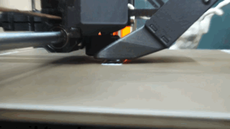

# Timelapse for Prusa

<p align="center">
    
</p>

**Timelapse for Prusa** (T4P) is a utility that uses a Raspberry Pi with a camera to capture images during a print and construct a timelapse. It can optionally email you the timelapse video, as well as upload images to Prusa Connect so you can monitor progress in the app.

T4P runs as a service on your Raspberry Pi. To protect your privacy, all processing is local. Once configured, it uses the local PrusaLink API to automatically detect the start and finish of prints. All timelapse videos are stored locally in a directory of your choosing.

You may optionally configure T4P to upload still frames to Prusa Connect during a print, enabling you to monitor its progress in the Prusa app. Also, you may optionally configure it to email the timelapse video to you when the print completes.

T4P is lightweight, and should run on any Raspberry Pi from the Zero 2 up.

## Requirements

### Hardware

- Raspberry Pi (any model, tested on Pi Zero 2)
- Pi Camera Module (tested on Arducam Module 3)
- Prusa printer with PrusaLink enabled

### Software

- Raspberry Pi OS (tested on Lite)

### Optional services

- Mail account
- Prusa Connect

## Setup

1. Enable PrusaLink on the printer:
    - LCD Menu → Settings → Network → PrusaLink (Enable)

1. Get Prusa API keys:
   - Log into [Prusa Connect](https://connect.prusa3d.com/login)
   - Go to Settings → API keys
   - Copy both keys

1. Find your printer's IP:
    - LCD Menu → Settings → Network → Show IP
    - Printer and Raspberry Pi must be on the same network

1. `ssh` into your Pi, clone this repo, and run:

    ```bash
    ./setup.sh
    ```

1. Follow steps 1-8. Once complete, T4P will run unattended.

## Configuration

Key `.env` settings:

| Variable | Default | Description |
| ---------- | --------- | ------------- |
| `PRUSA_PRINTER_HOST` | - | Printer IP/hostname (required) |
| `PRUSA_API_KEY` | - | PrusaLink API key (required) |
| `CAPTURE_INTERVAL_SECONDS` | 15 | Seconds between captures |
| `POLL_INTERVAL_SECONDS` | 10 | API polling frequency |
| `IMAGE_WIDTH` / `IMAGE_HEIGHT` | 1920x1080 | Capture resolution |
| `CAMERA_ROTATION` | 0 | Camera rotation (0, 90, 180, or 270 degrees) |
| `VIDEO_FPS` | 10 | Output video frame rate |
| `VIDEO_QUALITY` | 28 | CRF value (0-51, lower=better) |
| `VIDEO_BATCH_SIZE` | 30 | Frames per batch for memory-efficient processing |
| `PRINTS_DIR_NAME` | prints | Output directory name (in home folder) |
| `SMTP_SERVER` / `SMTP_PORT` | - | Optional: Send timelapse via email |
| `SMTP_USERNAME` / `SMTP_PASSWORD` | - | Leave empty for no auth |
| `EMAIL_FROM` / `EMAIL_TO` | - | Sender and recipient of emails |
| `RPICAM_EXTRA_PARAMS` | - | Optional: Extra rpicam-still parameters |
| `PRUSA_CONNECT_CAMERA_TOKEN` | - | Optional: Live monitoring token |
| `PRUSA_CONNECT_CAMERA_FINGERPRINT` | - | Optional: Camera fingerprint |

### Prusa Connect Live Monitoring (Optional)

Enable live snapshots on Prusa Connect website:

1. Visit <https://connect.prusa3d.com> → Add Camera
1. Copy the token to `PRUSA_CONNECT_CAMERA_TOKEN`
1. Generate fingerprint: `uuidgen` → Set as `PRUSA_CONNECT_CAMERA_FINGERPRINT`
1. Each captured frame is uploaded to Prusa Connect for live viewing
1. If `CAMERA_ROTATION` is set, images are automatically rotated before upload

### Email timelapse videos (Optional)

Send videos by email when complete:

1. Configure `SMTP_SERVER` and `SMTP_PORT`, at minimum
1. Configure `EMAIL_FROM` (the sender) and `EMAIL_TO` (the recipient)
1. If your mail server requires authentication, configure `SMTP_USERNAME` and `SMTP_PASSWORD`

## File Organization

Timelapse videos are stored in `~/prints/` (configurable via `PRINTS_DIR_NAME`) with the following structure:

```bash
~/prints/
├── 2026-01-03-14-30_MyPrintName.mp4
├── 2026-01-04-09-15_AnotherPrint.mp4
```

Images are captured to temporary subdirectories during printing, then automatically deleted after video creation to save space.

## Tips and tricks

### Choosing a Raspberry Pi and camera

T4P should work with anything that can run Raspberry Pi OS. It was developed for the ultra-low-power Raspberry Pi Zero 2, and the Arducam v3 module. Anything more powerful than this should work too.

### Check your dependencies

Use `setup.sh` to install your dependencies, and then check to make sure they're working.

### Verify the camera is working

Some cameras require additional setup. For example, here's how to configure the Arducam v3.

<details>

<summary>Instructions for Arducam v3 on Raspberry Pi OS Lite (Trixie)</summary>

Ensure you install the ribbon cable correctly: Black side up, pins toward the board.

1. Install Raspberry Pi OS Lite on your Pi Zero 2
1. Log in and upgrade everything:

    ```bash
    sudo apt update && sudo apt upgrade
    ```

1. Install the headless version of rpicam:

    ```bash
    sudo apt install rpicam-apps-lite
    ```

1. Check if the camera was detected:

    ```bash
    rpicam-hello --list-cameras
    ```

    You should see this:

    ```bash
    0 : imx708 [4608x2592 10-bit RGGB] (/base/soc/i2c0mux/i2c@1/imx708@1a)
    Modes: 'SRGGB10_CSI2P' : 1536x864 [120.13 fps - (768, 432)/3072x1728 crop]
    2304x1296 [56.03 fps - (0, 0)/4608x2592 crop]
    4608x2592 [14.35 fps - (0, 0)/4608x2592 crop]
    ```

1. Capture a test image:

    ```bash
    rpicam-still --immediate -o test.jpg
    ```

</details>

### Getting the focus right

Because the print bed moves so quickly, autofocus probably won't work very well. By default, T4P assumes a focal length of about 22cm - the distance from the X axis motor to the center of the print bed, assuming you [mount it like this](https://www.printables.com/search/models?q=MK4S+RPi%2FESP32+Cam+Mount).

If you mount your camera somewhere else, measure the distance in centimeters from the lens to the center of the print bed. Run `setup.sh`, choose `Configure focus distance`, and enter your measurement.

There are many other [`rpicam` parameters](https://linuxcommandlibrary.com/man/rpicam-still) available, you may need to experiment based upon your camera and mountpoint.

In `setup.sh`, choose `Capture and email current camera view` to test your settings.

### Use an app password with Gmail

Use [App Passwords](https://myaccount.google.com/apppasswords), not your login password.

### Make sure all required variables are set

Check that `.env` file is in the same directory as the script. Verify all required variables are set.

### Video attachment too large

If emails are correctly configured but aren't sending, you may be exceeding the maximum attachment size for your provider. Some email providers limit attachment size (typically 25MB). Reduce `VIDEO_FPS` or increase `VIDEO_QUALITY` (higher number = lower quality/smaller file).

### Memory optimization (especially Pi Zero 2 W)

For prints with many photos, high-resolution captures, or both, the Pi Zero 2's 512MB RAM can be strained during video creation. T4P automatically uses batch processing to minimize memory usage:

- **Below VIDEO_BATCH_SIZE frames**: Single-pass encoding (fastest)
- **Above VIDEO_BATCH_SIZE frames**: Batch processing (creates small video segments, then concatenates)

For example, if you are capturing at FHD (1920x1080) and VIDEO_BATCH_SIZE is set to 30, `ffmpeg` will consume roughly 70% of a Raspberry Pi Zero 2 W's system memory when assembling timelapse video segments.

If you still experience crashes, reduce `VIDEO_BATCH_SIZE` or `IMAGE_WIDTH` / `IMAGE_HEIGHT` in `.env`.

Lower batch sizes use less memory but take longer to encode.

## Credits

While this project is an original work, it was inspired by the excellent ideas in [Prusa Connect Cam](https://nvtkaszpir.github.io/prusa-connect-camera-script/).

## License

This project is licensed under [Apache License 2.0](https://spdx.org/licenses/Apache-2.0.html).
